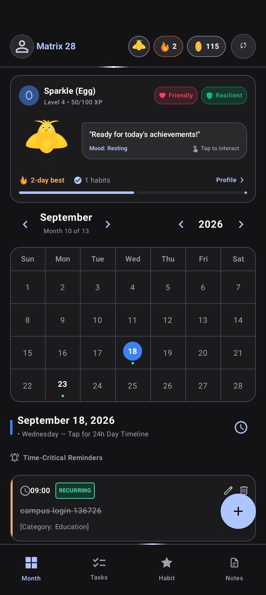
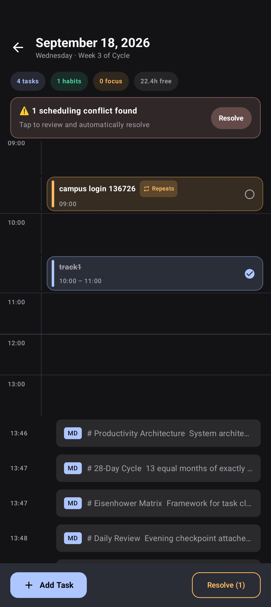
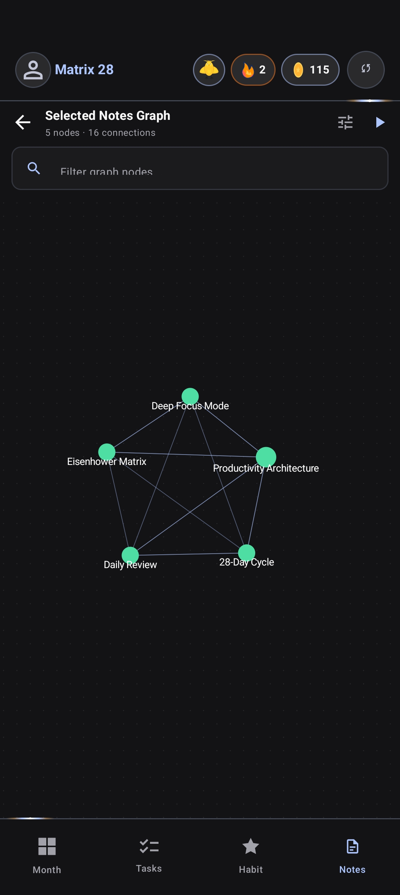
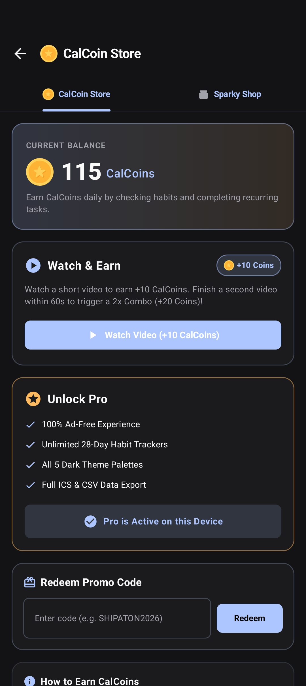

<p align="center">
  
</p>

<h1 align="center">Calender28</h1>

<p align="center">
  <strong>A local-first productivity workspace with a 28-day cyclical grid, Eisenhower conflict resolver, knowledge graph, and RevenueCat subscription tiers.</strong>
</p>

<p align="center">
  <a href="https://kotlinlang.org"></a>
  <a href="https://developer.android.com"></a>
  <a href="https://developer.android.com/jetpack/compose"></a>
  <a href="https://developer.android.com/training/data-storage/room"></a>
  <a href="https://www.revenuecat.com"></a>
  <a href="LICENSE"></a>
</p>

<p align="center">
  <a href="https://www.youtube.com/watch?v=GS6beTNc5O0"><strong>▶ Watch Video Demo</strong></a> •
  <a href="https://github.com/l1khith/Calender28/releases"><strong>📦 Download Latest Release (APK)</strong></a> •
  <a href="#-judge-instructions--promo-codes"><strong>🎟️ Judge Promo Codes</strong></a>
</p>

---

## 📺 Video Demo & Quick Links

- **Video Demo**: [https://www.youtube.com/watch?v=GS6beTNc5O0](https://www.youtube.com/watch?v=GS6beTNc5O0)
- **GitHub Repository**: [https://github.com/l1khith/Calender28](https://github.com/l1khith/Calender28)
- **APK Download / Releases**: [https://github.com/l1khith/Calender28/releases](https://github.com/l1khith/Calender28/releases)
- **Competition Track**: Next Gen Award (Student Track)

---

## 🌟 Inspiration

Traditional Gregorian calendars are mathematically chaotic: months range from 28 to 31 days, and weekdays shift randomly every month. This makes consistent habit tracking, quarterly retrospectives, and predictable time-blocking difficult. 

We built **Calender28** around a fixed 28-day cyclical model (13 equal months of 4 clean weeks), pairing predictable time architecture with an automated Eisenhower prioritization engine, connected Markdown knowledge graphs, and local-first data persistence.

---

## ✨ What It Does

- **📅 28-Day Cyclical Calendar**: 13 standardized 28-day months where every single week begins on Sunday and ends on Saturday. Dates always fall on the exact same weekday every single month.
- **⚖️ Automated Eisenhower Matrix & Conflict Resolver**: Categorizes tasks into four distinct urgency/importance quadrants and automatically suggests free scheduling slots when overlapping blocks are detected.
- **🕸️ Bi-directional Knowledge Graph**: Personal notes written in standard Markdown featuring `[[wiki-links]]` rendered dynamically on an interactive force-directed canvas.
- **🐕 28-Day Habit Cycles & Sparky Companion**: A companion pet that tracks cycle streaks, assesses daily focus time, and levels up across 28-day blocks.
- **💎 Dual Monetization (RevenueCat & AdMob)**: Seamless Pro subscriptions powered by RevenueCat, supplemented with in-app CalCoin rewards earned via an AdMob two-step rewarded video combo.
- **📱 Android Glance Widgets**: Home screen glanceables providing live cycle countdowns and real-time task agendas.
- **🔒 Biometric Security & 100% Local-First**: Private SQLite storage via Room; all notes, tasks, and habit data never leave the device.

---

## 📱 App Screenshots

<p align="center">
  <a href="art/screenshots/screenshot_1_month_view.jpg"></a>
  &nbsp;
  <a href="art/screenshots/screenshot_2_timeline_conflicts.jpg"></a>
  &nbsp;
  <a href="art/screenshots/screenshot_3_knowledge_graph.jpg"></a>
</p>

<p align="center">
  <a href="art/screenshots/screenshot_4_calcoin_store.jpg"></a>
  &nbsp;
  <a href="art/screenshots/screenshot_5_sparky_companion.jpg"></a>
  &nbsp;
  <a href="art/screenshots/screenshot_6_glance_widget.jpg"></a>
</p>

| # | Screen | Description | Link |
|---|---|---|---|
| 1 | **Main Month View** | Fixed 28-day 4-week calendar grid with perpetual day-of-week alignment and Sparky companion. | [View Full Res](art/screenshots/screenshot_1_month_view.jpg) |
| 2 | **Tasks / Day Timeline** | Time-blocking view featuring live conflict warning/banners and automated slot resolutions. | [View Full Res](art/screenshots/screenshot_2_timeline_conflicts.jpg) |
| 3 | **Connected Knowledge Graph** | Interactive force-directed canvas visualizing interconnected Markdown notes and `[[wiki-links]]`. | [View Full Res](art/screenshots/screenshot_3_knowledge_graph.jpg) |
| 4 | **CalCoin Store & Subscriptions** | RevenueCat Customer Center Pro management & AdMob rewarded video combos. | [View Full Res](art/screenshots/screenshot_4_calcoin_store.jpg) |
| 5 | **Sparky Companion Profile** | Companion evolution roadmap (Egg to Legend), personality traits, and streak XP progression. | [View Full Res](art/screenshots/screenshot_5_sparky_companion.jpg) |
| 6 | **Home Screen Glance Widget** | Android Glance home-screen widget displaying 28-day cycle progress and real-time agenda. | [View Full Res](art/screenshots/screenshot_6_glance_widget.jpg) |

---

## 🛠️ How We Built It

Calender28 is engineered 100% natively for Android:

- **UI & Architecture**: Jetpack Compose, Material 3, Clean Architecture (MVVM/MVI), Kotlin Coroutines, and reactive `StateFlow`.
- **Database & Offline Engine**: Room SQLite for zero-latency local-first offline storage.
- **Subscriptions & Entitlements**: Integrated the RevenueCat Android SDK (`Purchases`) and RevenueCat Customer Center to manage Monthly and Annual subscription tiers and offline entitlement caching.
- **Ad Monetization**: Google Mobile Ads SDK for rewarded video combos and interstitial placements.
- **Widgets**: Jetpack Glance for glanceable interactive home-screen surfaces.
- **Security**: AndroidX BiometricPrompt with hardware-backed KeyStore encryption and lock screen timeout.

### Architecture Overview

```
┌─────────────────────────────────────────────────────────────┐
│                       UI Layer                              │
│  Jetpack Compose Screens • ViewModels • StateFlow<UiState>  │
│  Eisenhower Conflict Resolver • Force-Directed Graph Canvas │
├─────────────────────────────────────────────────────────────┤
│                    Repository Layer                         │
│  TaskRepo • HabitRepo • NoteRepo • CoinRepo • FocusRepo    │
├─────────────────────────────────────────────────────────────┤
│                      Data Layer                             │
│  Room SQLite (DAOs, Indexed Tables) • DataStore Preferences │
├─────────────────────────────────────────────────────────────┤
│                   Platform & Services                       │
│  WorkManager • AlarmScheduler • Foreground FocusService     │
│  Glance Home Widget • BiometricPrompt • RevenueCat • AdMob  │
└─────────────────────────────────────────────────────────────┘
```

---

## 🧗 Challenges We Ran Into

- **Deterministic Calendar Conversion**: Developing a deterministic conversion engine between standard Gregorian dates and the fixed 13-month, 28-day cyclical system without breaking standard `.ics` calendar imports.
- **60 FPS Force-Directed Physics Canvas**: Implementing a physics-based, interactive force-directed graph canvas in pure Jetpack Compose that maintains 60 FPS while handling dynamic node collisions and multi-touch drag gestures.
- **Hybrid Economy Synchronization**: Coordinating client-side entitlement state between RevenueCat subscription purchases and local in-app CalCoin economy rewards.

---

## 🏆 Accomplishments That We're Proud Of

- Shipping a fully functional, offline-first productivity suite that feels instant, fluid, and battery-efficient.
- Successfully implementing end-to-end subscription entitlement checks and Customer Center integration via the RevenueCat SDK.
- Creating a dynamic bi-directional knowledge graph visualization rendered entirely within Jetpack Compose canvas.

---

## 🧠 What We Learned

- How to manage subscription lifecycles, entitlement gating, and customer management cleanly using RevenueCat without needing custom backend receipt-validation infrastructure.
- Best practices for building performant custom canvas graphics and interactive gesture layouts in Jetpack Compose.
- Designing offline-first reactive architectures that gracefully support background workers, widgets, and foreground services.

---

## 🔮 What's Next for Calender28

- **Bi-directional CalDAV Synchronization**: Connect and sync with self-hosted cloud calendars (Nextcloud, Google Calendar, Fastmail).
- **Encrypted Peer-to-Peer Note Sync**: Local Wi-Fi or WebRTC encrypted note synchronization between devices.
- **Advanced Habit Metrics & Custom Graph Queries**: Filter knowledge graph nodes by tags, date clusters, or Eisenhower priority states.

---

## 🎟️ Judge Instructions & Promo Codes

Paste this into the **Testing Instructions / Access** field on Devpost:

- **Track**: Next Gen Award (Student Track)
- **Source Code**: [https://github.com/l1khith/Calender28](https://github.com/l1khith/Calender28)
- **Testing Access**: Both `shipyard-android@revenuecat.com` and `shipyard@revenuecat.com` have been invited to our Google Play Internal Testing track. Alternatively, judges can download the signed release APK directly from our [GitHub Releases page](https://github.com/l1khith/Calender28/releases).
- **Free Trial / Promo Code**: Judges can test the in-app economy and unlock Pro access directly inside the app by opening the **CalCoin Store** and redeeming the promo code **`SHIPATON2026`** or **`MATRIXPRO`**.

---

## 🚀 Getting Started (Build from Source)

### Prerequisites
- **Android Studio**: Ladybug (2024.2+) or newer
- **JDK**: Version 17 or Version 21
- **Android SDK**: Compile SDK 35 / Min SDK 26 (Android 8.0+)

### Building

1. **Clone the repository:**
   ```bash
   git clone https://github.com/l1khith/Calender28.git
   cd Calender28
   ```

2. **Configure keys (optional):**
   Create a `secrets.properties` file in the project root:
   ```properties
   REVENUECAT_API_KEY=your_revenuecat_api_key_here
   ```

3. **Build the debug APK:**
   ```bash
   # On macOS / Linux
   ./gradlew assembleDebug

   # On Windows (PowerShell)
   .\gradlew assembleDebug
   ```

4. **Install onto connected device or emulator:**
   ```bash
   adb install -r app/build/outputs/apk/debug/app-debug.apk
   ```

---

## 📄 License

This project is licensed under the **MIT License** — see the [LICENSE](LICENSE) file for details.

```
MIT License
Copyright (c) 2026 Likhith (l1khith)
```
