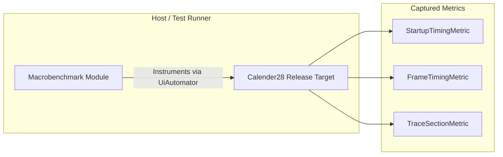

# 03. AndroidX Macrobenchmark & Baseline Profile Guide

Macrobenchmark measures whole-app performance on physical devices or emulators running userdebug builds. It exercises full compilation states (AOT, JIT, SpeedProfile) and captures real system-level traces via Perfetto.

---

## 1. Architecture Overview

Macrobenchmarks run in a separate test module against a release or non-debuggable build variant:



---

## 2. Setting Up Baseline Profiles

Baseline Profiles tell Android Runtime (ART) which code paths to pre-compile ahead of time (AOT) upon installation, cutting cold startup times by up to **40%**.

### Recommended Baseline Profile Generator:

```kotlin
package com.l1khith.calender28.benchmark

import androidx.benchmark.macro.junit4.BaselineProfileRule
import androidx.test.ext.junit.runners.AndroidJUnit4
import org.junit.Rule
import org.junit.Test
import org.junit.runner.RunWith

@RunWith(AndroidJUnit4::class)
class BaselineProfileGenerator {

    @get:Rule
    val baselineProfileRule = BaselineProfileRule()

    @Test
    fun generateBaselineProfile() = baselineProfileRule.collect(
        packageName = "com.l1khith.calender28"
    ) {
        // Cold start
        pressHome()
        startActivityAndWait()

        // Interact with 28-day Calendar Grid
        device.waitForIdle()

        // Navigate to Tasks Tab
        val tasksTab = device.findObject(androidx.test.uiautomator.By.text("Tasks"))
        tasksTab?.click()
        device.waitForIdle()

        // Navigate to Habit Tab
        val habitTab = device.findObject(androidx.test.uiautomator.By.text("Habits"))
        habitTab?.click()
        device.waitForIdle()
    }
}
```

---

## 3. Macrobenchmark Scenarios

### Scenario 1: Cold Startup Benchmark

Measures `Time to Initial Display (TTID)` and `Time to Full Display (TTFD)` across 10 iterations:

```kotlin
@RunWith(AndroidJUnit4::class)
class ColdStartupBenchmark {

    @get:Rule
    val benchmarkRule = MacrobenchmarkRule()

    @Test
    fun startupCold() = benchmarkRule.measureRepeated(
        packageName = "com.l1khith.calender28",
        metrics = listOf(StartupTimingMetric()),
        iterations = 10,
        startupMode = StartupMode.COLD
    ) {
        pressHome()
        startActivityAndWait()
    }
}
```

### Scenario 2: Calendar Month Grid Scroll & Frame Timing

Measures frame rendering durations and jank rate:

```kotlin
@RunWith(AndroidJUnit4::class)
class CalendarScrollBenchmark {

    @get:Rule
    val benchmarkRule = MacrobenchmarkRule()

    @Test
    fun scrollAgendaList() = benchmarkRule.measureRepeated(
        packageName = "com.l1khith.calender28",
        metrics = listOf(FrameTimingMetric()),
        iterations = 5,
        startupMode = StartupMode.WARM
    ) {
        pressHome()
        startActivityAndWait()

        // Scroll Agenda List
        val list = device.findObject(androidx.test.uiautomator.By.res("agenda_list"))
        list?.setGestureMargin(device.displayWidth / 5)
        list?.fling(androidx.test.uiautomator.Direction.DOWN)
        device.waitForIdle()
    }
}
```

---

## 4. Benchmark Gradle Commands

To run macrobenchmarks on a connected physical test device:

```bash
# Run startup benchmarks
./gradlew :benchmark:connectedCheck -Pandroid.testInstrumentationRunnerArguments.class=com.l1khith.calender28.benchmark.ColdStartupBenchmark

# Generate new baseline profile rules
./gradlew :app:generateBaselineProfile
```
