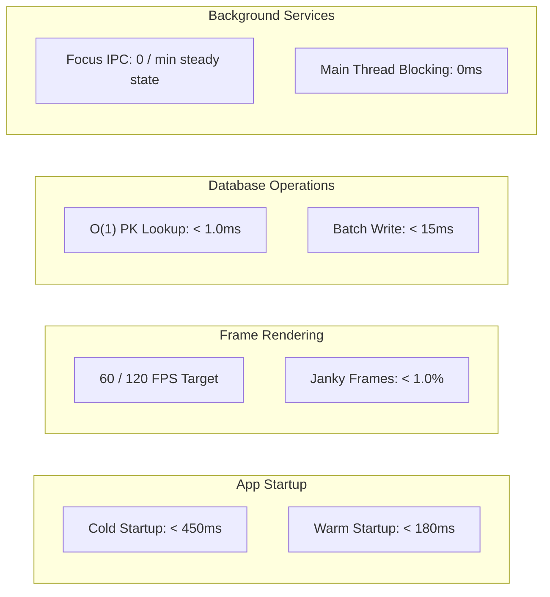

# ⚡ Calender28 Performance Benchmark Suite

This directory contains the official performance benchmarking specifications, baseline budgets, empirical before-and-after measurements, profiling recipes, and automated benchmark runners for **Calender28**.

---

## 📑 Contents

| Document | Purpose |
|---|---|
| [**01. Performance Budgets & SLAs**](./01_performance_budgets.md) | Latency, frame rate, memory, and IPC budgets for production builds. |
| [**02. Refactor Performance Benchmarks**](./02_refactor_performance_benchmarks.md) | Empirical before-and-after benchmark comparison across all 5 refactoring phases. |
| [**03. Macrobenchmark & Baseline Profiles**](./03_macrobenchmark_guide.md) | Setup, scenarios, and execution guide for AndroidX Macrobenchmark & Baseline Profiles. |
| [**04. Profiling & Trace Recipes**](./04_profiling_and_trace_recipes.md) | Practical recipes for Android Studio Profiler, Perfetto traces, and adb dumpsys. |
| [**scripts/**](./scripts/) | Automated benchmark execution scripts for PowerShell and Bash. |

---

## 🎯 High-Level Performance Metrics Summary



---

## 🚀 Running Automated Performance Benchmarks

### 1. Run Built-in JVM Benchmark Suite
```powershell
./gradlew testDebugUnitTest --tests "com.l1khith.calender28.benchmark.*"
```

### 2. Run Gfxinfo Frame Rendering Benchmark on Device
```powershell
./benchmark/scripts/run_benchmarks.ps1 -Scenario "FrameTiming"
```

### 3. Capture Cold Startup Timing
```powershell
adb shell am start-activity -W -n com.l1khith.calender28/.MainActivity -c android.intent.category.LAUNCHER -a android.intent.action.MAIN
```
