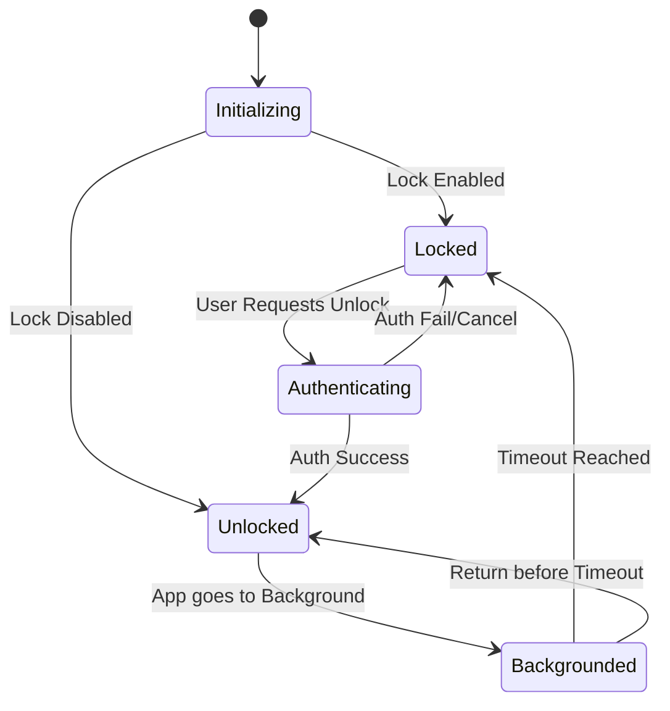
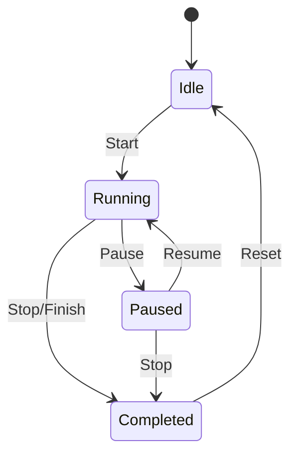

# 12. State Machine Patterns

## AppLock State Machine

**Current problem:** Uses boolean flags `_isLocked`, `_isAppLockEnabled`, and a manual timestamp. This leads to the relock loop bug and data-flash-before-lock bug.

**Target:** Sealed interface with 5 states: `Initializing`, `Locked`, `Authenticating`, `Unlocked`, `Backgrounded`.

**Mermaid state diagram:**


**Rules:**
- Only valid transitions allowed.
- Impossible states are unrepresentable (e.g. cannot be `Locked` and `Authenticating` at the same time).

**WHY:** Eliminates relock loop bug, data-flash-before-lock bug, and guarantees robust auth flow.

## Focus Timer State Machine

**Current problem:** `FocusSessionManager` tracks manual wall-clock vars, mixes service/notification/vibration/repo. Leads to state drift bugs.

**Target:** Sealed interface with states: `Idle`, `Running(startMs, accumulated)`, `Paused(accumulated)`, `Completed(totalMs)`.

**Mermaid state diagram:**


**WHY:** Eliminates state drift bugs, cleanly separates timer business logic from side effects like notifications and vibrations.

## General Pattern

Implementing a state machine in Kotlin using sealed interfaces and transition functions guarantees safe state transitions.

```kotlin
sealed interface State {
    fun transition(event: Event): State
}

// Example Implementation
sealed interface FocusState : State {
    object Idle : FocusState {
        override fun transition(event: Event): State = when(event) {
            is Event.Start -> Running(System.currentTimeMillis(), 0L)
            else -> this
        }
    }
    
    data class Running(val startMs: Long, val accumulated: Long) : FocusState {
        override fun transition(event: Event): State = when(event) {
            is Event.Pause -> Paused(accumulated + (System.currentTimeMillis() - startMs))
            is Event.Stop -> Completed(accumulated + (System.currentTimeMillis() - startMs))
            else -> this
        }
    }
    
    // Paused, Completed...
}
```
