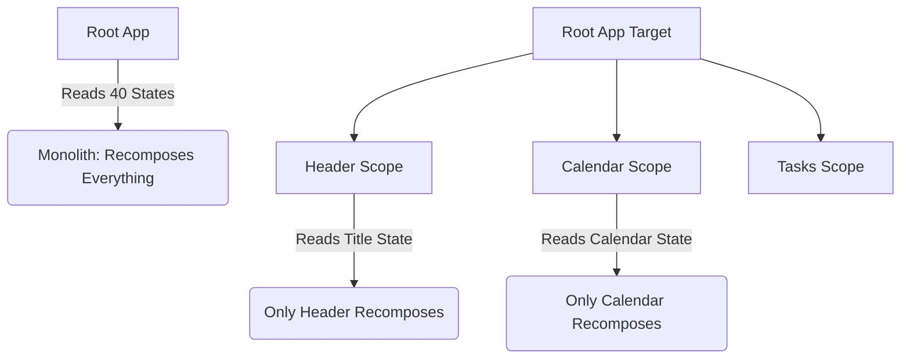

# 13. Compose Performance Rules

## Section 1: Recomposition Scope Isolation

**How Compose recomposition scopes work:** Compose tracks state reads. Only the nearest enclosing `@Composable` scope that reads a state will recompose when that state changes.
**Why a 2320-line composable reading 40 states recomposes everything:** If a single monolithic composable reads all states at the root level, *any* state change triggers a recomposition of the *entire* 2320 lines of UI.
**How extracting sub-composables creates isolated scopes:** By extracting UI into smaller `@Composable` functions and passing only the necessary state (or hoisting), Compose can skip recomposing parts of the UI whose inputs haven't changed.

**Diagram:**

**WHY:** Reduces wasted CPU cycles and dropped frames by isolating recomposition.

## Section 2: GraphicsLayer Lambda Rule (CRITICAL)

There is a major difference between setting modifier values directly vs using the lambda version.
- `Modifier.graphicsLayer(rotation = value)`: Reads the `value` during COMPOSITION. If `value` changes (e.g. an animation), it triggers recomposition.
- `Modifier.graphicsLayer { rotation = value }`: Reads the `value` during the DRAW phase. ZERO recomposition overhead for animations.
- The same applies to `Modifier.scale()`, `Modifier.alpha()`, `Modifier.rotate()`, `Modifier.offset { }`.

**Before (Bad):**
```kotlin
val alpha by animateFloatAsState(...)
Box(modifier = Modifier.alpha(alpha)) // Causes recomposition every frame of animation
```

**After (Good):**
```kotlin
val alpha by animateFloatAsState(...)
Box(modifier = Modifier.graphicsLayer { this.alpha = alpha }) // Zero recomposition
```
**WHY:** Avoids blocking the UI thread with unnecessary recompositions during high-framerate animations.

## Section 3: Stability & Skipping

- **`@Stable` vs `@Immutable`:** Use `@Immutable` for data classes where all properties are permanently fixed. Use `@Stable` for interfaces or classes whose public properties might change but notify Compose (like State or StateFlow wrappers).
- **The `List<T>` False Promise:** Compose considers `java.util.List` (the default Kotlin `List`) as unstable because it could be a `MutableList` under the hood. Marking a class with `@Immutable` when it holds a `List` can still break skipping if not careful.
- **Genuine Immutability:** Use `kotlinx.collections.immutable.ImmutableList` (`persistentListOf()`) to guarantee immutability to the Compose compiler and enable skipping.
- **State Collection:** Prefer `collectAsStateWithLifecycle()` over `collectAsState()` to ensure flows pause collection when the app is in the background.
**WHY:** Ensures Compose can safely skip recompositions for unmodified data models.

## Section 4: Common Anti-Patterns in This Project

- **Reading 40 StateFlows in one composable scope:** Centralized in `FixedCalendarApp.kt`. Extract features!
- **Creating ViewModels in root instead of feature screens:** Leads to unnecessary global lifecycle and state bleeding.
- **Allocating objects (Brush, Color, Path) inside draw loops:** `DrawScope` functions (like `onDrawBehind`) run often. Avoid object allocation inside them to prevent GC thrashing.
- **Not remembering callback lambdas:** Passing inline lambdas (`{ doSomething() }`) that capture changing variables without `remember` causes recomposition because the lambda instance changes.
**WHY:** Fixing these patterns will eliminate jank and smooth out user interactions.
