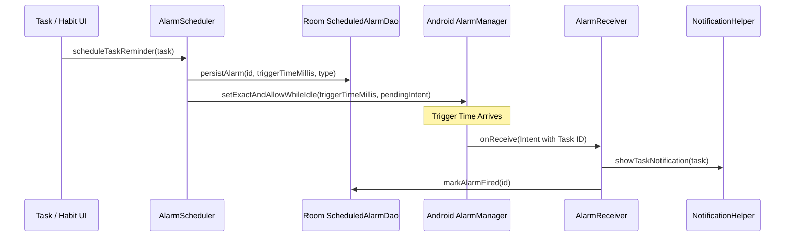

# Feature Spec 05: Exact Alarms, Reminders & Boot Restoration

## 1. Overview
The **Notification & Alarm Engine** manages time-critical delivery of task reminders, daily habit prompts, and scheduled alerts. It guarantees exact delivery on Android 14+ (Target SDK 37) using Android's `AlarmManager` exact scheduling APIs and restores all pending alerts upon device reboot.

---

## 2. Core Components & Architecture

### Source Files
* **Scheduler**: [`AlarmScheduler.kt`](file:///c:/Users/ailik/AndroidStudioProjects/Calender28/app/src/main/kotlin/com/l1khith/calender28/service/AlarmScheduler.kt)
* **Receivers**:
  * [`AlarmReceiver.kt`](file:///c:/Users/ailik/AndroidStudioProjects/Calender28/app/src/main/kotlin/com/l1khith/calender28/service/AlarmReceiver.kt)
  * [`BootReceiver.kt`](file:///c:/Users/ailik/AndroidStudioProjects/Calender28/app/src/main/kotlin/com/l1khith/calender28/service/BootReceiver.kt)
  * [`NotificationActionReceiver.kt`](file:///c:/Users/ailik/AndroidStudioProjects/Calender28/app/src/main/kotlin/com/l1khith/calender28/service/NotificationActionReceiver.kt)
* **Helpers**:
  * [`NotificationHelper.kt`](file:///c:/Users/ailik/AndroidStudioProjects/Calender28/app/src/main/kotlin/com/l1khith/calender28/service/NotificationHelper.kt)
  * [`NotificationPermissionHelper.kt`](file:///c:/Users/ailik/AndroidStudioProjects/Calender28/app/src/main/kotlin/com/l1khith/calender28/service/NotificationPermissionHelper.kt)
* **Database Entity**: [`ScheduledAlarmEntity`](file:///c:/Users/ailik/AndroidStudioProjects/Calender28/app/src/main/kotlin/com/l1khith/calender28/data/Entities.kt), [`ScheduledAlarmDao`](file:///c:/Users/ailik/AndroidStudioProjects/Calender28/app/src/main/kotlin/com/l1khith/calender28/data/Daos.kt) in `Daos.kt`

---

## 3. Alarm Scheduling Lifecycle

---

## 4. Technical Capabilities

### A. Exact Timing with Android 12+ / 14+ / 16 Compatibility
* Checks `alarmManager.canScheduleExactAlarms()` before calling `setExactAndAllowWhileIdle()`.
* If permission is revoked, falls back safely to `setAndAllowWhileIdle()` or prompts the user via `ACTION_REQUEST_SCHEDULE_EXACT_ALARM`.

### B. Notification Channels & Categories
* **Task Reminders Channel**: High importance, sound + vibration, heads-up banner.
* **Habit Prompts Channel**: Default importance, daily recurring prompt.
* **Focus Timer Channel**: Low importance, silent ongoing foreground notification.

### C. Boot Restoration Mechanism (`BootReceiver`)
* Listens for `android.intent.action.BOOT_COMPLETED` and `MY_PACKAGE_REPLACED`.
* On reboot, queries `ScheduledAlarmDao` for all uncompleted alarms with future trigger timestamps and reschedules them with `AlarmManager`.

### D. Direct Notification Actions
* **Complete Task**: Marks task as completed directly from the notification shade without opening the application.
* **Snooze (15m)**: Automatically recalculates and schedules a new exact alarm 15 minutes in the future.

---

## 5. Security & Intent Sanitation
* All `PendingIntent` instances specify explicit `FLAG_IMMUTABLE` or `FLAG_MUTABLE` flags compliant with Android 12+ security guidelines.
* Explicit component targeting on all broadcast intents to prevent Intent Redirection vulnerabilities.
