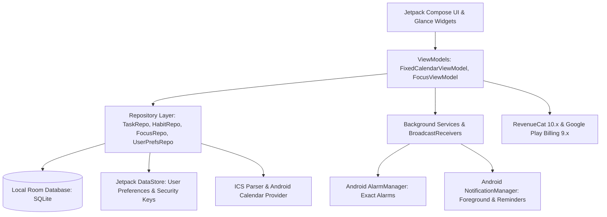

# Calender28 — Feature Documentation Catalog

Welcome to the comprehensive feature documentation for **Calender28**. Calender28 is a decentralized, on-device productivity platform built with modern Android (Jetpack Compose, Room, Kotlin Coroutines & Flow, Material 3, and Glance).

This documentation provides deep technical architecture, component breakdown, data contracts, and edge-case handling for every feature currently implemented in the application.

---

## 📚 Feature Matrix & Documentation Index

| # | Feature | Documentation Link | Core Components |
|---|---|---|---|
| 01 | **Fixed 28-Day Calendar Engine** | [01_fixed_calendar_engine.md](01_fixed_calendar_engine.md) | `FixedCalendarHelper`, `FixedDate`, 13-Month Math, Sol Month, Year Day |
| 02 | **Eisenhower Matrix Task Management** | [02_eisenhower_matrix_tasks.md](02_eisenhower_matrix_tasks.md) | `TasksScreen`, `CreateTaskScreen`, 4 Quadrants, `TaskRepository`, Overdue Engine |
| 03 | **28-Day Habit Cycles & Streaks** | [03_habit_tracker_and_streaks.md](03_habit_tracker_and_streaks.md) | `HabitScreen`, `HabitCycleEngine`, `HabitRepository`, Completion Bitmaps |
| 04 | **Deep Focus & Pomodoro Service** | [04_deep_focus_pomodoro.md](04_deep_focus_pomodoro.md) | `FocusService`, `FocusSessionManager`, `FocusScreens`, Notification Actions |
| 05 | **Exact Alarms & Smart Reminders** | [05_notifications_and_alarms.md](05_notifications_and_alarms.md) | `AlarmScheduler`, `AlarmReceiver`, `BootReceiver`, `NotificationHelper` |
| 06 | **Calendar Sync & ICS File Import/Export** | [06_calendar_sync_and_ics.md](06_calendar_sync_and_ics.md) | `CalendarSyncHelper`, `IcsParserRepository`, `TaskExportHelper`, SAF |
| 07 | **Biometric App Lock & Security** | [07_biometric_app_lock.md](07_biometric_app_lock.md) | `AppLockManager`, `AppLockScreens`, BiometricPrompt, PIN Fallback |
| 08 | **Matrix Dynamic Multi-Theme Engine** | [08_theme_engine.md](08_theme_engine.md) | `ThemeManager`, `MatrixColors`, `MatrixShapes`, 5 Design Themes |
| 09 | **Jetpack Glance Home Screen Widgets** | [09_glance_home_widgets.md](09_glance_home_widgets.md) | `TodayTaskWidget`, `WidgetUpdater`, Glance Material 3, AppWidgetReceiver |
| 10 | **Pro Monetization, RevenueCat & Ads** | [10_monetization_and_pro.md](10_monetization_and_pro.md) | `SubscriptionManager`, RevenueCat 10.x, Play Billing 9.x, AdMob Banner |
| 11 | **Native Notes Module** | [11_notes_system.md](11_notes_system.md) | `NoteEntity`, `NoteDao`, `NoteRepository`, `NotesListScreen`, Plain Text & Markdown |

---

## 🏗️ Architectural Overview

---

## 🔒 Core Engineering Principles

1. **100% On-Device Decentralization**: Zero cloud database dependency. All tasks, habit logs, and focus sessions remain stored locally in Room SQLite.
2. **Deterministic Time Calculations**: Explicit leap-year and day-of-year calculations ensure exact 28-day month alignment without Gregorian drift.
3. **Clean Unidirectional Data Flow (UDF)**: ViewModels emit immutable `StateFlow` streams consumed cleanly by Compose screens and Glance widgets.
4. **Android 16 / Target SDK 37 Ready**: Compliant with exact alarm scheduling permissions, predictive back gestures, edge-to-edge system bars, and Play Billing Library v9.
