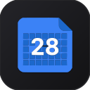
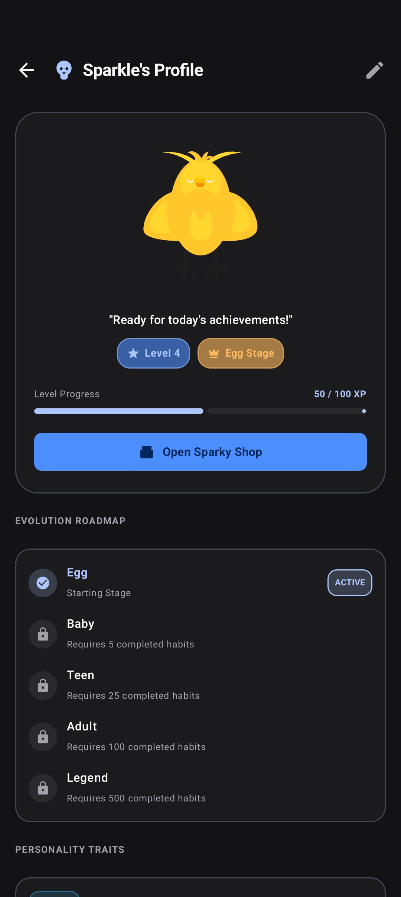
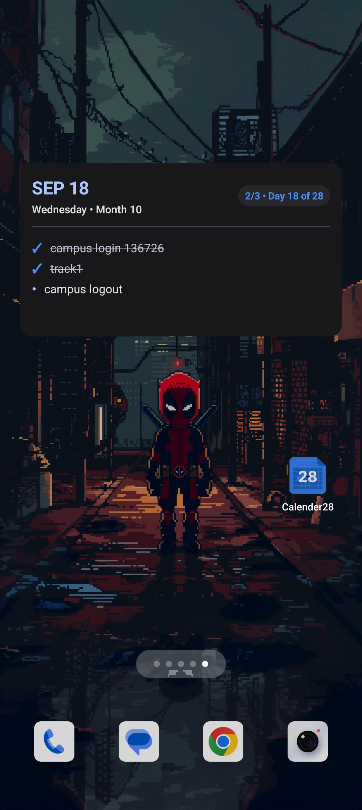

  

<h1 align="center" style="font-weight: 700; letter-spacing: -0.03em; margin-bottom: 4px;">Calender28</h1>

  Time, Restructured.

  A local-first productivity workspace combining a 28-day cyclical grid, automated Eisenhower conflict resolution, bi-directional knowledge graphs, and RevenueCat subscription tiers. Engineered with the principles of essentialism and uncompromised privacy.

  <a href="https://github.com/l1khith/Calender28/releases" style="display:inline-block; padding: 10px 20px; background-color: #0071e3; color: white; border-radius: 980px; text-decoration: none; font-weight: 600; font-size: 0.95rem; margin-right: 8px;">Download Release APK</a>
  <a href="https://www.youtube.com/watch?v=GS6beTNc5O0" style="display:inline-block; padding: 10px 20px; background-color: #f5f5f7; color: #1d1d1f; border-radius: 980px; text-decoration: none; font-weight: 600; font-size: 0.95rem; border: 1px solid #d2d2d7; margin-right: 8px;">Watch Demo</a>
  <a href="https://github.com/l1khith/Calender28" style="display:inline-block; padding: 10px 20px; background-color: #f5f5f7; color: #1d1d1f; border-radius: 980px; text-decoration: none; font-weight: 600; font-size: 0.95rem; border: 1px solid #d2d2d7;">GitHub</a>

  <a href="#-the-philosophy" style="color: inherit; text-decoration: underline;">Philosophy</a> &nbsp;•&nbsp;
  <a href="#-core-capabilities" style="color: inherit; text-decoration: underline;">Capabilities</a> &nbsp;•&nbsp;
  <a href="#-interface-gallery" style="color: inherit; text-decoration: underline;">Gallery</a> &nbsp;•&nbsp;
  <a href="#%EF%B8%8F-technical-specifications" style="color: inherit; text-decoration: underline;">Architecture</a> &nbsp;•&nbsp;
  <a href="#2-privacy-policy" style="color: inherit; text-decoration: underline;">Privacy Policy</a> &nbsp;•&nbsp;
  <a href="#3-terms-of-service" style="color: inherit; text-decoration: underline;">Terms of Service</a> &nbsp;•&nbsp;
  <a href="#refund-policy" style="color: inherit; text-decoration: underline;">Refund Policy</a> &nbsp;•&nbsp;
  <a href="#4-contact-information" style="color: inherit; text-decoration: underline;">Contact</a>

---

## 🏛️ The Philosophy

Traditional calendars are mathematically asymmetric. Months fluctuate arbitrarily between 28 and 31 days. Weekday alignments drift endlessly. Scheduling intervals change, distorting retrospectives, recurring habits, and focus metrics.

**Calender28** discards arbitrary calendar irregularities in favor of the **International Fixed Calendar**:

| Dimension | Gregorian Standard | Calender28 Fixed Model |
|---|---|---|
| **Months per Year** | 12 (Irregular lengths) | **13 (Exactly 28 days each)** |
| **Weeks per Month** | ~4.3 weeks (Variable) | **Exactly 4 clean weeks (28 days)** |
| **First Day of Month** | Random day of the week | **Always Sunday** |
| **Last Day of Month** | Random day of the week | **Always Saturday** |
| **Intercalary Month** | None | **Sol** (Inserted between June & July) |
| **Year Completer** | Leap days | **Year Day** (A timeless celebration day) |

> *"Simplicity is not the absence of clutter, that's a consequence of simplicity. Simplicity is somehow essentially describing the purpose and place of an object and product."*

Every single month in Calender28 reflects identical geometry: the 1st is always Sunday, the 14th is always Saturday, and the 28th concludes the cycle. Your habits, sprints, and reflections gain a calm, predictable tempo.

---

## ⚡ Core Capabilities

### 1. The Perpetual 28-Day Grid
Experience time without mental friction. Navigate across 13 uniform months with fluid gestures, continuous cycle progress indicators, and instant bidirectional conversion with standard Gregorian dates for full system interoperability.

### 2. Eisenhower Matrix & Automated Conflict Resolver
Tasks are organized across urgency and importance vectors. When time-blocked tasks overlap, Calender28 detects the clash immediately, presenting an intelligent banner that analyzes your schedule and proposes conflict-free slots in a single tap.

### 3. Bi-directional Knowledge Graph
Note-taking reduced to pure expression. Freeform Markdown writing without required titles—your opening line forms the concept naturally. Connect ideas with `[[wiki-links]]` and watch your notes assemble in real time onto an interactive 60 FPS force-directed physics graph.

### 4. 28-Day Habit Cycles & Sparky Companion
Build lasting discipline through fixed 28-day habit cycles. Your virtual companion, **Sparky**, matures through multiple life stages (from Egg to Legend) as you accumulate focus minutes, win confidence contracts, and maintain streaks.

### 5. Pomodoro Focus Engine with Anti-Cheat
Deep work intervals backed by foreground timing services, screen pinning modes, and tactile haptic feedback. Navigating away during strict sessions penalizes coin rewards, keeping your attention guarded.

### 6. Dual Monetization (RevenueCat & AdMob)
Seamless subscription entitlements managed via the official RevenueCat SDK and RevenueCat Customer Center. Supplemented with an optional in-app CalCoin reward system powered by AdMob two-step rewarded video combos.

### 7. Android Glance Widgets
Live glanceable surfaces directly on your Android home screen. Review today's priority agenda and track your exact day-of-cycle progress without ever opening the app.

### 8. Local-First & Biometric Security
Your thoughts, habits, and schedules are exclusively yours. Calender28 stores everything locally in an indexed SQLite database via Room. Biometric authentication (fingerprint / face unlock) safeguards access using the device's hardware security module.

---

## 📱 Interface Gallery

  
  &nbsp;
  
  &nbsp;
  

  
  &nbsp;
  
  &nbsp;
  

| View | Focus | Detail |
|---|---|---|
| **01. Month Architecture** | Fixed 28-day 4-week calendar grid | Symmetrical day layout, cycle streak tracker, and Sparky state |
| **02. Conflict Resolution** | Automated timeline scheduling | Urgent conflict detection, time blocking, and 1-tap slot resolver |
| **03. Knowledge Graph** | Interactive node topology | Dynamic force-directed canvas visualizing `[[wiki-links]]` |
| **04. Subscription Center** | RevenueCat & CalCoin economy | Pro entitlement status, ad combo bonus, and promo code redemption |
| **05. Companion Evolution** | Sparky profile & roadmap | Progressive evolutionary stages (Egg to Legend) and habit XP |
| **06. Glance Widget** | Android home screen surface | Real-time 28-day cycle counter and instant task checklist |

---

## 🛠️ Technical Specifications

Calender28 is developed natively for Android using modern declarative foundations:

- **Language & Runtime:** Kotlin 2.1.20 with structured concurrency (Coroutines & StateFlow)
- **UI Framework:** 100% Jetpack Compose (BOM 2025.06) with Material 3 design tokens
- **Persistence:** Local SQLite via AndroidX Room 2.7.1 with indexed schemas and zero remote sync
- **Subscriptions & Billing:** RevenueCat Android Purchases SDK 10.x & Customer Center UI
- **Ad Monetization:** Google Mobile Ads (AdMob) 24.x for rewarded video combos
- **Background Operations:** AndroidX WorkManager 2.10.0 for deterministic midnight rollovers
- **Glanceables:** Jetpack Glance 1.1.1 interactive app widgets
- **Security:** AndroidX Biometric 1.1.0 with hardware-backed KeyStore security

---

# Legal Policies & Terms of Service

## 1. Introduction

Welcome to Calender28 ("we", "our", "us"). This document combines our Privacy Policy and Terms of Service. By downloading, installing, or using Calender28 ("the App"), you agree to both the Privacy Policy and the Terms of Service described below. If you do not agree, please do not use the App.

---

## 2. Privacy Policy

### 2.1 Information We Collect

Calender28 is designed with privacy as a priority. We collect minimal information:

**Local Data (Stored Only on Your Device):**
- Habit data (names, descriptions, progress)
- Recurring task data
- Cycle tracking data
- CalCoin balance and transaction history
- Streak information
- App preferences and settings

**Data We Do NOT Collect:**
- No personal identifiable information (name, email, phone number)
- No location data
- No contact list access
- No camera or microphone access
- No data is sent to our servers

### 2.2 Permissions

The App requests the following permissions solely for core functionality:

| Permission | Purpose |
|------------|---------|
| **Calendar** | To sync habit cycles and reminders |
| **Notifications** | To send reminders for habits and tasks |
| **Storage** | To export data (CSV/ICS/JSON) |
| **Biometric** | For optional app lock |

All permissions are optional. You can use the App without granting permissions, though some features may be limited.

### 2.3 AdMob Advertising

The App uses Google AdMob to display ads in the Free tier. AdMob may collect:
- Device identifiers (Android Advertising ID)
- IP address
- App usage data

This data is used to show relevant ads and is governed by Google's Privacy Policy:
[https://policies.google.com/privacy](https://policies.google.com/privacy)

### 2.4 In-App Purchases & Subscriptions

The App uses RevenueCat and Google Play Billing for:
- One-time Premium purchases
- Premium subscriptions
- Virtual currency (CalCoins)

All purchase data is handled by Google Play Services and RevenueCat. We do not store your payment information.

### 2.5 Data Storage & Security

- **All user data is stored locally** on your device using Room (SQLite) database.
- No data is transmitted to external servers.
- You are solely responsible for backing up your data.
- If you uninstall the App, all data is permanently deleted.

### 2.6 Children's Privacy

Calender28 is not directed at children under 13. We do not knowingly collect data from children.

### 2.7 Changes to This Privacy Policy

We may update this policy. Continued use constitutes acceptance of the updated policy.

---

## 3. Terms of Service

### 3.1 Acceptance of Terms

By using Calender28, you agree to these Terms. If you disagree, do not use the App.

### 3.2 User Accounts

Calender28 does not require user accounts. All data is stored locally on your device. You are solely responsible for:
- Backing up your data
- Maintaining device security
- Any data loss due to device failure, uninstallation, or app data clearing

### 3.3 In-App Purchases & Virtual Currency

**Premium Unlock Options:**
1. **One-time purchase** through Google Play Billing
2. **Subscription** through Google Play Billing
3. **CalCoins** (in-app virtual currency)

**CalCoins Rules:**
- Earned through app usage (habit completion, streaks, daily logins)
- No real-world monetary value
- Cannot be transferred, refunded, or exchanged for real currency
- Not purchasable with real money (earned only)

**Premium via CalCoins:**
- **Cost:** 1,500 CalCoins (one-time)
- Premium unlocks are permanent
- Tied to the device's local storage
- **Refund Policy:** All CalCoin-based purchases are final. If you uninstall the App, your CalCoins and premium status will **not** be restored.

**Premium via Subscription/One-Time Purchase:**
- Handled through Google Play Billing and RevenueCat
- Follows Google Play's refund policy
- Tied to your Google Play account

---

## Refund Policy

All purchases made through Calender28 are processed by Google Play
Billing and managed via RevenueCat.

### Subscription Purchases

Subscriptions are billed on a recurring basis (monthly or yearly)
through your Google Play account.

**Calender28 does not offer refunds for subscription purchases.**
This includes but is not limited to:

- Unused time remaining in a billing period
- Forgetting to cancel a subscription before renewal
- Change of mind after purchase
- Lack of usage of the app
- Device incompatibility discovered after purchase

### One-Time Purchases (In-App Products)

All one-time purchases (including CalCoins and permanent Premium
unlocks) are final and non-refundable.

### Google Play's 48-Hour Self-Service Window

For the first 48 hours after a purchase, Google Play may allow
users to request a refund directly through Google Play's own
refund system without contacting the developer. This is outside
the developer's control and is governed by Google Play's policies.

### Cancellation vs. Refund

You may cancel your subscription at any time through the Google
Play Store. **Cancelling a subscription stops future billing but
does not issue a refund for the current or past billing periods.**
Access to Premium features continues until the end of the paid
period already charged.

### Abuse & Revocation of Digital Entitlements

All digital entitlements, Premium upgrades, and unlocked features are tied directly to active verification with Google Play and RevenueCat. If any transaction is refunded, revoked, or subject to a payment dispute/chargeback by Google Play or the payment provider, all associated Premium features, ad-free privileges, and balances are automatically and permanently terminated on the device immediately upon processing.

### Exception — Applicable Law

Nothing in this policy limits any non-waivable rights you may have
under applicable consumer protection laws in your jurisdiction.

### How to Cancel

To cancel your subscription:

1. Open the Google Play Store app
2. Tap your profile icon
3. Go to Payments & subscriptions → Subscriptions
4. Select Calender28
5. Tap Cancel subscription

For help with cancellation, contact us at: likid2d21@gmail.com

**Last Updated: September 22, 2026**

---

### 3.4 Premium Features

| Feature | Free | Premium |
|---------|------|---------|
| Habit Limit | 5 habits | Unlimited |
| Ad Experience | With Ads | Ad-Free |
| Dark Mode | ❌ | ✅ |
| Advanced Stats | Basic | Full analytics |
| Data Export | ❌ | CSV/ICS export |
| Custom Themes | ❌ | Multiple themes |
| Priority Support | ❌ | ✅ |

### 3.5 User Conduct

You agree NOT to:
- Use the App for any unlawful purpose
- Attempt to reverse engineer, decompile, or modify the App
- Exploit bugs, vulnerabilities, or cheats
- Use the App in a way that harms others

### 3.6 Intellectual Property

Calender28 and all its content (including but not limited to code, design, and assets) are owned by the developer and protected by copyright laws. You may not copy, modify, or redistribute the App without permission.

### 3.7 Disclaimer of Warranties

Calender28 is provided **"as is"** and **"as available"**. We make no warranties, express or implied, regarding:
- The App's accuracy or reliability
- Fitness for a particular purpose
- Merchantability
- Uninterrupted or error-free operation

### 3.8 Limitation of Liability

To the maximum extent permitted by law, we are NOT liable for:
- Data loss (due to uninstallation, device failure, or app data clearing)
- Device damage
- Any indirect, incidental, or consequential damages
- Loss of profits or savings

### 3.9 Indemnification

You agree to indemnify and hold harmless the developer from any claims arising from your use of the App.

### 3.10 Changes to These Terms

We reserve the right to update these Terms at any time. Changes become effective immediately upon posting. Continued use constitutes acceptance.

### 3.11 Governing Law

These Terms are governed by the laws of India, without regard to conflict of laws principles.

### 3.12 Promo Codes

From time to time, we may offer promo codes for:
- Free CalCoins
- Free Premium access

Promo codes are:
- One-time use per user
- Subject to expiration dates
- Non-transferable
- Not redeemable for cash

### 3.13 Termination

We reserve the right to suspend or terminate your access to the App if you violate these Terms. Violations may also result in forfeiture of CalCoins and premium status.

### 3.14 Severability

If any part of these Terms is found unenforceable, the remaining parts remain in full effect.

### 3.15 Entire Agreement

This document constitutes the entire agreement between you and the developer regarding Calender28.

---

## 4. Contact Information

**Developer:** Likhith  
**Email:** likid2d21@gmail.com  
**GitHub:** [https://github.com/l1khith](https://github.com/l1khith)  
**App Website:** [https://l1khith.github.io/Calender28](https://l1khith.github.io/Calender28)

For privacy concerns or questions about these terms, contact us at the email above.

---

**Last Updated:** September 27, 2026
